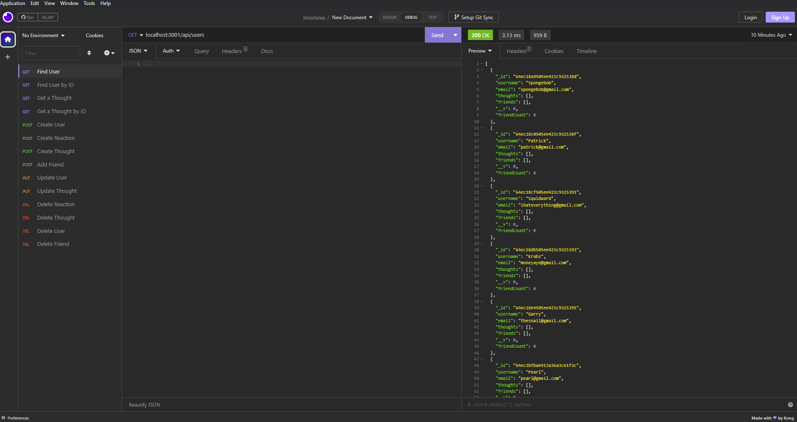
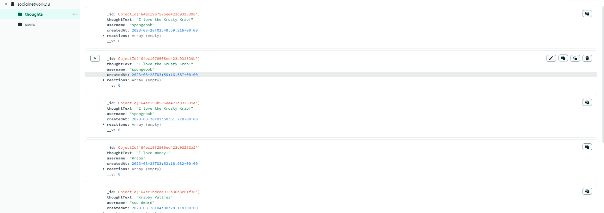

# NoSQL Challenge 18                        

## Description

This application allows you to create a social media app that stores user data, using the NoSQL database MongoDB. Users can create their own usernames, add friends, and share their thoughts. Users can also react to other users thoughts and add or remove friends. As for the devleper, they can delete users, thoughts, and reactions using the MongoDB compass application and connecting their social media apps database to it.

## Table of Contents

- [Description](#description)
- [Installation](#installation)
- [Usage](#usage)
- [License](#license)
- [Contributing](#contributing)
- [Tests](#tests)
- [Questions](#questions)

## Installation

To install this application you must clone the repo, then run `npm install` in the root directory to install all the dependencies. You must also have MongoDB installed on your computer. Once you have done that, you can run `npm start` to start the application. You can then use Insomnia Core to test the routes.

## Usage

The usage for this application is to allow a social network to be created, where the user can feel like theyre in control of what others can see and who they want to talk to.

## License

MIT

## Contributing

Gustavo Diaz

## Tests

## Questions

For more information, visit my GitHub profile: [diazgus411](https://github.com/diazgus411/NoSQL)

To contact me, send an email to: "diazgus411@gmail.com"
